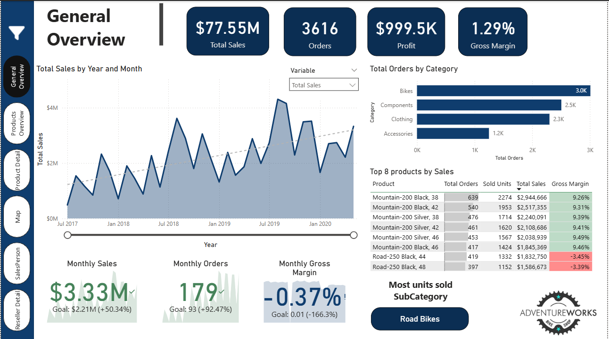
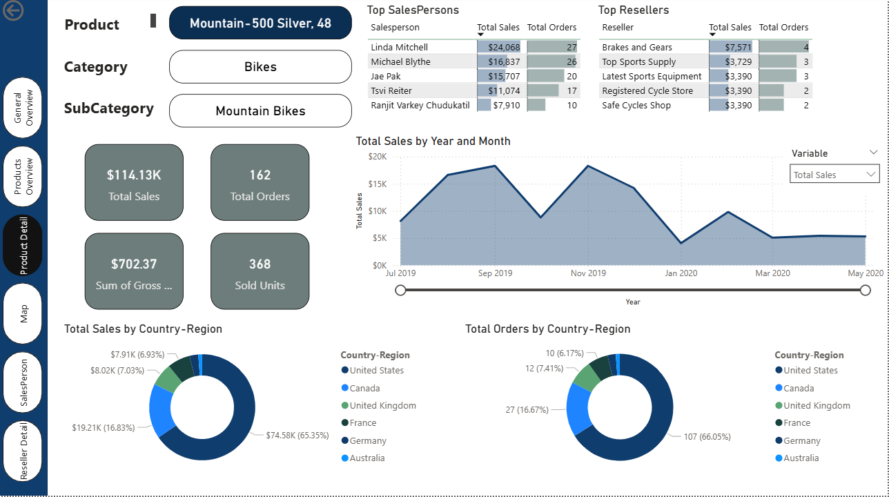
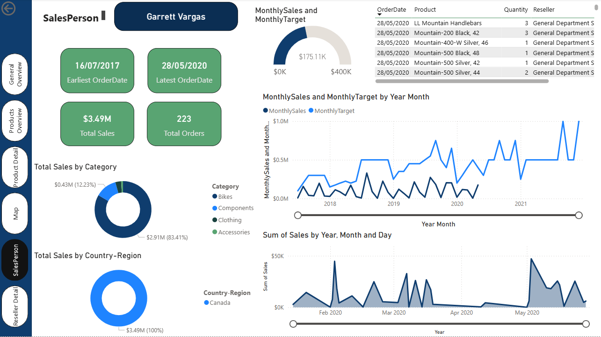

# Power BI Sales Dashboard – AdventureWorks 2022

This project presents a professional Power BI dashboard built using Microsoft's **AdventureWorks 2022** dataset. It showcases data modeling, DAX measures, Power Query transformations, and interactive visualizations.

---

## Project Overview

The dashboard was designed to analyze sales performance across different dimensions including products, customers, regions, and time. It provides clear insights and KPIs to support business decisions.

---

## Tools & Technologies

- Power BI Desktop
- DAX (Data Analysis Expressions)
- Power Query (M language)
- AdventureWorks 2022 dataset (CSV version)

---

## Folder Structure

```text
powerbi-adventureworks2022/
├── reports/
│   └── Dashboard.pbix
├── docs/
│   └── preview.png
├── README.md
└── LICENSE
```
---

## Dashboard Preview








---

## Key Features

- **KPIs**: Total Sales, Gross Margin, YTD Sales
- **Product Analysis**: Sales by category and subcategory
- **Customer Insights**: Top customers by revenue
- **Geographical Analysis**: Sales by country/region
- **Time Intelligence**: YTD, YoY growth, monthly trends
- **Interactive elements**: Slicers, filters, bookmarks, drill-through

---

## Files Included

- `reports/Dashboard.pbix`: Main Power BI file with model and visuals
- `docs/preview.png`: Screenshot of the dashboard

---

## Data Source

- **Dataset:** AdventureWorks 2022 sample data from Microsoft  
- **CSV version available on Kaggle:**  
  [https://www.kaggle.com/datasets/favorsk/adventureworks-lt-database](https://www.kaggle.com/datasets/favorsk/adventureworks-lt-database)

---

## How to Open the Project

1. Download or clone the repository.
2. Open `reports/Dashboard.pbix` using Power BI Desktop.
3. Refresh the data source if necessary (depending on file path).
